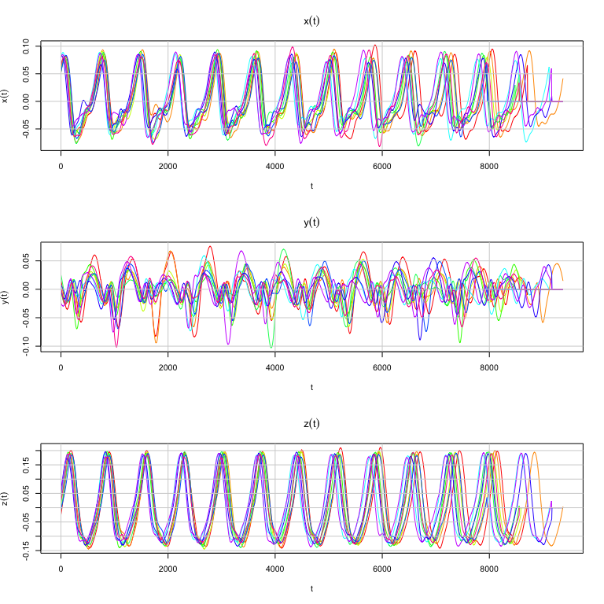

Code for ‘FDA in Biomechanics’
================
Edward Gunning

This repository contains `R` code for the manuscript ‘FDA in
Biomechanics’.

## Notes

- For Chapters 1 to 5, standard `.R` scripts to reproduce each figure is
  contained in a separate folder:
  - :open_file_folder: [**Chapter 1**](chapter-01/)
  - :open_file_folder: [**Chapter 2**](chapter-02/)
  - :open_file_folder: [**Chapter 3**](chapter-03/)
  - :open_file_folder: [**Chapter 4**](chapter-04/)
  - :open_file_folder: [**Chapter 5**](chapter-05/)
- For the ‘Case Study’ chapter, ***Quarto*** notebooks that document the
  case study analysis in a step-by-step fashion are also provided:
  - 📔 [**Part 1** - Data Import and
    Exploration](chapter-06/Case-Study-Part-01-MD.md)
  - 📔 [**Part 2** - Analysis of Healthy Controls]()
  - 📔 [**Part 3** - Analysis of Impaired Movement]()

# Data

The data used in the review are all publicly available.

1.  **The Childrens’ Gait Data Set** can be accessed directly from the
    `fda` package:

``` r
library(fda)
data("gait")
gaittime <- as.numeric(rownames(gait))
par(mfrow = c(1, 2))
matplot(x = gaittime,
        y = gait[,,1],
        type = "b",
        pch = 20, 
        lty = 1, 
        cex = 0.75,
        xlab = "Normalised Time",
        ylab = "Angle (°)",
        main = "Hip")
grid(lty = 1)
matplot(x = gaittime,
        y = gait[,,2],
        type = "b",
        pch = 20, 
        cex = 0.75,
        lty = 1, 
        xlab = "Normalised Time",
        ylab = "Angle (°)",
        main = "Knee")
grid(lty = 1)
```


2.  **The Juggling Data** were initially downloaded from
    (<https://archive.mbi.ohio-state.edu/vod/mbi-media/e-162/1400789954_juggling.zip>)\[<https://archive.mbi.ohio-state.edu/vod/mbi-media/e-162/1400789954_juggling.zip>\]
    **but the link is no longer working - FIX this. GET PERMISSION FROM
    JIM RAMSAY!!!!**. The data can be accessed from from within this
    repository as follows:

``` r
x <- readr::read_table2("chapter-02/juggling-data/Xcoord.txt", col_names = FALSE) # x coordinates
y <- readr::read_table2("chapter-02/juggling-data//Ycoord.txt", col_names = FALSE) # y coordinates
z <- readr::read_table2("chapter-02/juggling-data//Zcoord.txt", col_names = FALSE) # z co-ordinates

cols <- rainbow(ncol(x)) 
t <- (0:(nrow(x)-1)) * 5 # time arguments (approx. ms)
par(mfrow = c(3, 1))
matplot(t, as.matrix(x), type = "l", lty = 1, xlab = expression(t), ylab = expression(x(t)), col = cols)
grid(lty = 1)
title(expression(x(t)))
matplot(t, as.matrix(y), type = "l", lty = 1, xlab = expression(t), ylab = expression(y(t)), col = cols)
grid(lty = 1)
title(expression(y(t)))
matplot(t, as.matrix(z), type = "l", lty = 1, xlab = expression(t), ylab = expression(z(t)), col = cols)
grid(lty = 1)
title(expression(z(t)))
```



3.  **The GaitRec Data Set** is available for download at
    [here](doi:10.6084/m9.figshare.c.4788012.v1). We have written a `.R`
    script to import and wrangle the subset of the data used in the
    review in [📄 here](chapter-06/01-data-import-and-wrangling.R).

# Session Information (Reproducibility)

``` r
sessionInfo()
```

    ## R version 4.1.2 (2021-11-01)
    ## Platform: x86_64-apple-darwin17.0 (64-bit)
    ## Running under: macOS Big Sur 10.16
    ## 
    ## Matrix products: default
    ## BLAS:   /Library/Frameworks/R.framework/Versions/4.1/Resources/lib/libRblas.0.dylib
    ## LAPACK: /Library/Frameworks/R.framework/Versions/4.1/Resources/lib/libRlapack.dylib
    ## 
    ## locale:
    ## [1] en_IE.UTF-8/en_IE.UTF-8/en_IE.UTF-8/C/en_IE.UTF-8/en_IE.UTF-8
    ## 
    ## attached base packages:
    ## [1] splines   stats     graphics  grDevices utils     datasets  methods  
    ## [8] base     
    ## 
    ## other attached packages:
    ## [1] fda_5.5.1      deSolve_1.30   fds_1.8        RCurl_1.98-1.6 rainbow_3.6   
    ## [6] pcaPP_1.9-74   MASS_7.3-55    Matrix_1.4-0  
    ## 
    ## loaded via a namespace (and not attached):
    ##  [1] pracma_2.3.8       pillar_1.9.0       compiler_4.1.2     highr_0.9         
    ##  [5] ks_1.13.4          bitops_1.0-7       tools_4.1.2        digest_0.6.29     
    ##  [9] mclust_5.4.9       tibble_3.2.1       lifecycle_1.0.3    evaluate_0.15     
    ## [13] lattice_0.20-45    pkgconfig_2.0.3    rlang_1.1.1        cli_3.6.0         
    ## [17] rstudioapi_0.13    yaml_2.3.5         mvtnorm_1.1-3      xfun_0.39         
    ## [21] fastmap_1.1.0      stringr_1.4.0      cluster_2.1.2      knitr_1.37        
    ## [25] vctrs_0.6.2        hms_1.1.1          grid_4.1.2         glue_1.6.2        
    ## [29] hdrcde_3.4         R6_2.5.1           fansi_1.0.2        rmarkdown_2.11    
    ## [33] tzdb_0.2.0         readr_2.1.2        magrittr_2.0.2     ellipsis_0.3.2    
    ## [37] htmltools_0.5.5    colorspace_2.0-3   utf8_1.2.2         KernSmooth_2.23-20
    ## [41] stringi_1.7.6      crayon_1.5.0

# References

## Childrens’ Gait Data

- Olshen, R. A., Biden, E. N., Wyatt, M. P., & Sutherland, D. H. (1989).
  Gait Analysis and the Bootstrap. The Annals of Statistics, 17(4),
  1419–1440. JSTOR.

- Rice, J. A., & Silverman, B. W. (1991). Estimating the Mean and
  Covariance Structure Nonparametrically When the Data are Curves.
  Journal of the Royal Statistical Society. Series B (Methodological),
  53(1), 233–243. JSTOR.

- Leurgans, S. E., Moyeed, R. A., & Silverman, B. W. (1993). Canonical
  Correlation Analysis when the Data are Curves. Journal of the Royal
  Statistical Society. Series B (Methodological), 55(3), 725–740. JSTOR.

- Ramsay, J. O., & Silverman, B. W. (2005). Functional Data Analysis
  (2nd ed.). Springer-Verlag. <https://doi.org/10.1007/b98888>

- Ramsay, J. O., Graves, S., & Hooker, G. (2020). `fda`: Functional Data
  Analysis. R package version 5.5.1.
  <https://CRAN.R-project.org/package=fda>

## Juggling Data

- Ramsay, J. O., Gribble, P., & Kurtek, S. (2014). Description and
  processing of functional data arising from juggling trajectories.
  Electronic Journal of Statistics, 8(2), 1811–1816.
  <https://doi.org/10.1214/14-EJS937>

- Ramsay, J. O. (2014). Functional data analysis of juggling
  trajectories: Rejoinder. Electronic Journal of Statistics, 8(2),
  1874–1878. <https://doi.org/10.1214/14-EJS937REJ>

- Ramsay, J. O., Gribble, P., & Kurtek, S. (2014). Analysis of juggling
  data: Landmark and continuous registration of juggling trajectories.
  Electronic Journal of Statistics, 8(2), 1835–1841.
  <https://doi.org/10.1214/14-EJS937C>

## GaitRec

- Horsak, B., Slijepcevic, D., Raberger, A.-M., Schwab, C., Worisch, M.,
  & Zeppelzauer, M. (2020). GaitRec, a large-scale ground reaction force
  dataset of healthy and impaired gait. Scientific Data, 7(1),
  Article 1. <https://doi.org/10.1038/s41597-020-0481-z>

- Publicly Available Data-Sharing Repository:
  <doi:10.6084/m9.figshare.c.4788012.v1>

## Edward Gunning’s Ph.D. Thesis

- The examples in this review were initially developed for Edward
  Gunning’s Ph.D. thesis. The corresponding `GitHub` repository that was
  released is hosted at
  <https://github.com/FAST-ULxNUIG/thesis-chapt-1-2>
