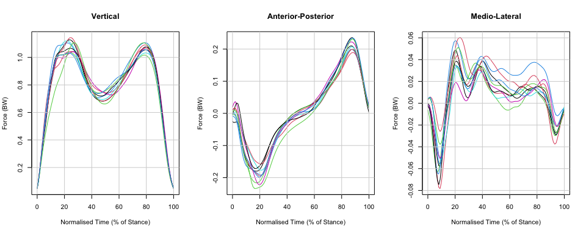

Code for ‘*Functional Data Analysis in Biomechanics: A Concise Review of
Core Techniques, Applications and Emerging Areas*’
================
Edward Gunning

This repository contains `R` code for the SpringerBriefs publication
[‘Functional Data Analysis in
Biomechanics’](https://link.springer.com/book/9783031688614). It is due
to be published in October 2024.

<figure>

<figcaption aria-hidden="true">The front cover for <a
href="https://link.springer.com/book/9783031688614">‘Functional Data
Analysis in Biomechanics’</a>.</figcaption>
</figure>

## Notes

- For all chapters, standard `.R` scripts to reproduce each figure are
  contained in a separate folder:
  - :open_file_folder: [**Chapter 1**](chapter-01/)
  - :open_file_folder: [**Chapter 2**](chapter-02/)
  - :open_file_folder: [**Chapter 3**](chapter-03/)
  - :open_file_folder: [**Chapter 4**](chapter-04/)
  - :open_file_folder: [**Chapter 5**](chapter-05/)
  - :open_file_folder: [**Case Study**](chapter-06/)
- For the **‘Case Study’** chapter, ***Quarto*** (and `.RMD`) notebooks
  that document the case study analysis in a step-by-step fashion are
  also provided:
  - 📔 [**Part 1** - Data Import and
    Exploration](chapter-06/Case-Study-Part-01-MD.md)
  - 📔 [**Part 2** - Analysis of Healthy
    Controls](chapter-06/Case-Study-Part-02-MD.md)
  - 📔 [**Part 3** - Analysis of Impaired
    Movement](chapter-06/Case-Study-Part-03-MD.md)

# Data

The data used in the review are all publicly available.

1.  **The Childrens’ Gait Data Set** can be accessed directly from the
    `fda` package:

``` r
library(fda)
data("gait")
gaittime <- as.numeric(rownames(gait))
par(mfrow = c(1, 2))
matplot(x = gaittime,
        y = gait[,,1],
        type = "b",
        pch = 20, 
        lty = 1, 
        cex = 0.75,
        xlab = "Normalised Time",
        ylab = "Angle (°)",
        main = "Hip")
grid(lty = 1)
matplot(x = gaittime,
        y = gait[,,2],
        type = "b",
        pch = 20, 
        cex = 0.75,
        lty = 1, 
        xlab = "Normalised Time",
        ylab = "Angle (°)",
        main = "Knee")
grid(lty = 1)
```


2.  **The Juggling Data** were initially downloaded from
    (<https://archive.mbi.ohio-state.edu/vod/mbi-media/e-162/1400789954_juggling.zip>)
    but the link is no longer working. With permission from Prof. Jim
    Ramsay, we have uploaded a copy of the data to
    :open_file_folder:[**chapter-02/juggling-data/**](chapter-02/juggling-data/),
    which can be accessed from within this repository as follows:

``` r
x <- readr::read_table2("chapter-02/juggling-data/Xcoord.txt", col_names = FALSE) # x coordinates
y <- readr::read_table2("chapter-02/juggling-data//Ycoord.txt", col_names = FALSE) # y coordinates
z <- readr::read_table2("chapter-02/juggling-data//Zcoord.txt", col_names = FALSE) # z co-ordinates

cols <- rainbow(ncol(x)) 
t <- (0:(nrow(x)-1)) * 5 # time arguments (approx. ms)
par(mfrow = c(3, 1))
matplot(t, as.matrix(x), type = "l", lty = 1, xlab = expression(t), ylab = expression(x(t)), col = cols)
grid(lty = 1)
title(expression(x(t)))
matplot(t, as.matrix(y), type = "l", lty = 1, xlab = expression(t), ylab = expression(y(t)), col = cols)
grid(lty = 1)
title(expression(y(t)))
matplot(t, as.matrix(z), type = "l", lty = 1, xlab = expression(t), ylab = expression(z(t)), col = cols)
grid(lty = 1)
title(expression(z(t)))
```


3.  **The GaitRec Data Set** is available for download at
    <https://doi.org/10.6084/m9.figshare.c.4788012.v1>. We have written
    a `.R` script to import, wrangle and store the subset of the data
    used in the review in [📄
    here](chapter-06/01-data-import-and-wrangling.R).

``` r
# from the stored copy:
gaitrec <- readRDS("chapter-06/data/GRF_dataset_PRO_meta.rds")

# split into three force components:
v <- as.matrix(gaitrec[gaitrec$component == "vertical", paste0("time_", 0:100)])
ap <- as.matrix(gaitrec[gaitrec$component == "anterior_posterior", paste0("time_", 0:100)])
ml <- as.matrix(gaitrec[gaitrec$component == "medio_lateral", paste0("time_", 0:100)])

# plot first 10 obs.:
par(mfrow = c(1, 3))
matplot(x = 0:100,
        y = t(v[1:10,]),
        type = "l",
        lty = 1,
        xlab = "Normalised Time (% of Stance)", 
        ylab = "Force (BW)")
grid(lty = 1)
title("Vertical")
matplot(x = 0:100,
        y = t(ap[1:10,]),
        type = "l", 
        lty = 1, 
        xlab = "Normalised Time (% of Stance)",
        ylab = "Force (BW)")
grid(lty = 1)
title("Anterior-Posterior")
matplot(x = 0:100,
        y = t(ml[1:10,]), 
        type = "l", 
        lty = 1, 
        xlab = "Normalised Time (% of Stance)",
        ylab = "Force (BW)")
grid(lty = 1)
title("Medio-Lateral")
```



# Packages

We primarily use the `fda` (Ramsay, Hooker and Graves, 2020) and
`refund` (Goldsmith et al., 202) `R` packages to fit functional data
analysis models to biomechanical data.

These extensive software packages have full, dedicated textbooks on how
to use them:

- `fda`: Ramsay, Hooker and Graves (2009)

- `refund`: Crainiceanu, Goldsmith, Leroux and Cui (2024) (just
  released)

These texts, along with the reference manuals for the packages, as great
places to learn about the full functionality of the packages.

# `tikzDevice`

We use the [`tikzDevice`
package](https://cran.r-project.org/web/packages/tikzDevice/index.html)
to produce figure outputs in $\LaTeX$ (e.g., fonts and math symbols). If
you are not interested in producing the `.pdf` plots with latex font,
then calls such as `tikz(...)` can be ignored.

# References

## Childrens’ Gait Data

- Olshen, R. A., Biden, E. N., Wyatt, M. P., & Sutherland, D. H. (1989).
  Gait Analysis and the Bootstrap. The Annals of Statistics, 17(4),
  1419–1440. JSTOR.

- Rice, J. A., & Silverman, B. W. (1991). Estimating the Mean and
  Covariance Structure Nonparametrically When the Data are Curves.
  Journal of the Royal Statistical Society. Series B (Methodological),
  53(1), 233–243. JSTOR.

- Leurgans, S. E., Moyeed, R. A., & Silverman, B. W. (1993). Canonical
  Correlation Analysis when the Data are Curves. Journal of the Royal
  Statistical Society. Series B (Methodological), 55(3), 725–740. JSTOR.

- Ramsay, J. O., & Silverman, B. W. (2005). Functional Data Analysis
  (2nd ed.). Springer-Verlag. <https://doi.org/10.1007/b98888>

- Ramsay, J. O., Graves, S., & Hooker, G. (2020). `fda`: Functional Data
  Analysis. R package version 5.5.1.
  <https://CRAN.R-project.org/package=fda>

## Juggling Data

- Ramsay, J. O., Gribble, P., & Kurtek, S. (2014). Description and
  processing of functional data arising from juggling trajectories.
  Electronic Journal of Statistics, 8(2), 1811–1816.
  <https://doi.org/10.1214/14-EJS937>

- Ramsay, J. O. (2014). Functional data analysis of juggling
  trajectories: Rejoinder. Electronic Journal of Statistics, 8(2),
  1874–1878. <https://doi.org/10.1214/14-EJS937REJ>

- Ramsay, J. O., Gribble, P., & Kurtek, S. (2014). Analysis of juggling
  data: Landmark and continuous registration of juggling trajectories.
  Electronic Journal of Statistics, 8(2), 1835–1841.
  <https://doi.org/10.1214/14-EJS937C>

## GaitRec

- Horsak, B., Slijepcevic, D., Raberger, A.-M., Schwab, C., Worisch, M.,
  & Zeppelzauer, M. (2020). GaitRec, a large-scale ground reaction force
  dataset of healthy and impaired gait. Scientific Data, 7(1),
  Article 1. <https://doi.org/10.1038/s41597-020-0481-z>

- Publicly Available Data-Sharing Repository:
  <a href="https://doi.org:10.6084/m9.figshare.c.4788012.v1"
  class="uri">https://doi.org:10.6084/m9.figshare.c.4788012.v1</a>

## Edward Gunning’s Ph.D. Thesis

- The examples in this review were initially developed for Edward
  Gunning’s Ph.D. thesis. The corresponding `GitHub` repository that was
  released is hosted at
  <https://github.com/FAST-ULxNUIG/thesis-chapt-1-2>

## `tikzDevice`

- Sharpsteen, C., Bracken, C., Müller, K., Xie, Y., Stubner, R., &
  Bellack, N. (2023). R package ‘tikzDevice’
  <https://github.com/daqana/tikzDevice>.

## `refund`

- Goldsmith, J., Scheipl, F., Huang, L., Wrobel, J., Di, C.-Z., Gellar,
  J., Harezlak, J., McLean, M. W., Swihart, B., Xiao, L.,
  Crainiceanu, C. M., Reiss, P. T., Chen, Y., Greven, S., Huo, L.,
  Kundu, M. G., Park, S. Y., Miller, D. L., & Staicu, A.-M. (2020).
  `refund`: Regression with Functional Data (0.1-23) \[Sp-ES\].
  <https://CRAN.R-project.org/package=refund>

- Crainiceanu, C. M., Goldsmith, J., Leroux, A., & Cui, E. (2024).
  Functional Data Analysis with R (1st edition). Chapman and Hall/CRC.

# Session Information (Reproducibility)

``` r
sessionInfo()
```

    ## R version 4.4.1 (2024-06-14)
    ## Platform: aarch64-apple-darwin20
    ## Running under: macOS Sonoma 14.5
    ## 
    ## Matrix products: default
    ## BLAS:   /Library/Frameworks/R.framework/Versions/4.4-arm64/Resources/lib/libRblas.0.dylib 
    ## LAPACK: /Library/Frameworks/R.framework/Versions/4.4-arm64/Resources/lib/libRlapack.dylib;  LAPACK version 3.12.0
    ## 
    ## locale:
    ## [1] en_US.UTF-8/en_US.UTF-8/en_US.UTF-8/C/en_US.UTF-8/en_US.UTF-8
    ## 
    ## time zone: Europe/Dublin
    ## tzcode source: internal
    ## 
    ## attached base packages:
    ## [1] splines   stats     graphics  grDevices utils     datasets  methods  
    ## [8] base     
    ## 
    ## other attached packages:
    ## [1] fda_6.1.8       deSolve_1.40    fds_1.8         RCurl_1.98-1.14
    ## [5] rainbow_3.8     pcaPP_2.0-4     MASS_7.3-60.2  
    ## 
    ## loaded via a namespace (and not attached):
    ##  [1] Matrix_1.7-0       crayon_1.5.3       compiler_4.4.1     highr_0.11        
    ##  [5] ks_1.14.2          bitops_1.0-7       cluster_2.1.6      yaml_2.3.8        
    ##  [9] fastmap_1.2.0      lattice_0.22-6     readr_2.1.5        R6_2.5.1          
    ## [13] knitr_1.47         tibble_3.2.1       tzdb_0.4.0         pillar_1.9.0      
    ## [17] rlang_1.1.4        utf8_1.2.4         hdrcde_3.4         xfun_0.45         
    ## [21] cli_3.6.3          magrittr_2.0.3     digest_0.6.36      grid_4.4.1        
    ## [25] rstudioapi_0.16.0  mvtnorm_1.2-5      hms_1.1.3          mclust_6.1.1      
    ## [29] lifecycle_1.0.4    vctrs_0.6.5        KernSmooth_2.23-24 glue_1.7.0        
    ## [33] evaluate_0.24.0    pracma_2.4.4       fansi_1.0.6        colorspace_2.1-0  
    ## [37] rmarkdown_2.27     tools_4.4.1        pkgconfig_2.0.3    htmltools_0.5.8.1
