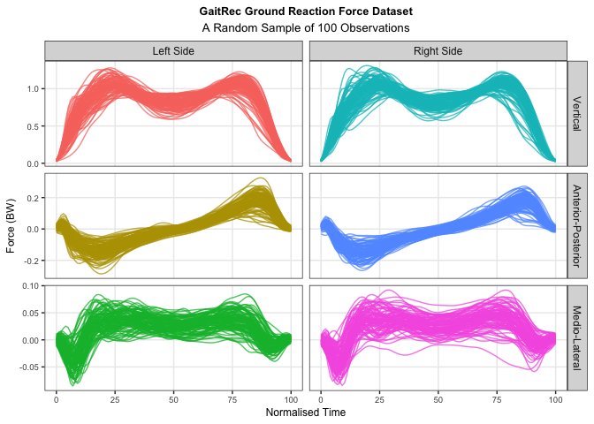
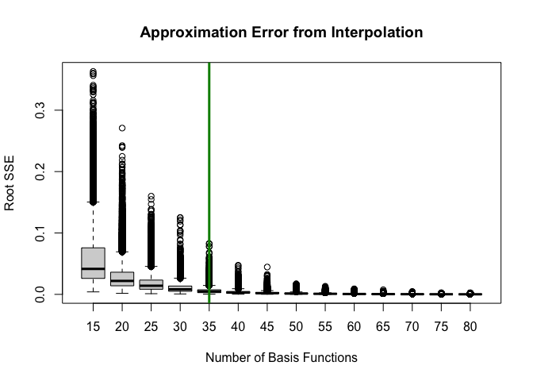
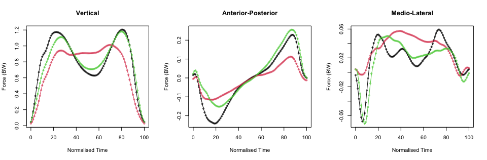
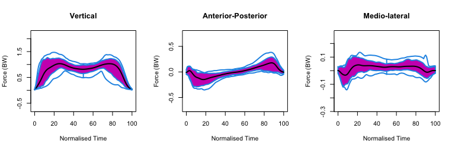
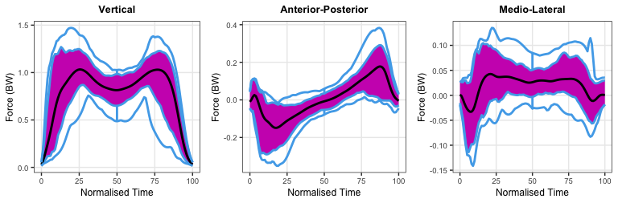

Case Study Part 1
================

# Set Up and Data Import

## Packages

``` r
library(tidyverse)  # CRAN v1.3.1 
library(data.table) # CRAN v1.14.2
library(fda)        # CRAN v5.5.1
library(modelsummary) # CRAN v1.14.2(for table)
```

## Load Custom Functions

``` r
source(here::here("functions", "theme_gunning.R"))
source(here::here("functions", "functional_boxplot_gg.R"))
theme_gunning()
```

## Read in Data

``` r
# Read in from storage:
GRF_dataset_PRO_meta <- readRDS(file = here::here("chapter-06",
                                                  "data",
                                                  "GRF_dataset_PRO_meta.rds"))
```

## Plot a Sample of Curves

``` r
# ggplot requires reshaping data from wide to long.
# do reshaping with data.table because it's a little easier
# and then continue to use data.table for a little while!
GRF_dataset_PRO_meta <- data.table(GRF_dataset_PRO_meta)
GRF_dataset_PRO_meta_long <- melt.data.table(GRF_dataset_PRO_meta,
                measure.vars = paste0("time_", 0:100),
                variable.name = "time",
                value.name = "force")
GRF_dataset_PRO_meta_long[, time := as.numeric(stringr::str_remove(time, "time_"))]
GRF_dataset_PRO_meta_long[, obs_id := paste(SUBJECT_ID, SESSION_ID, TRIAL_ID, sep = "_")]
```

``` r
# Take Sample of Observations
set.seed(1)
random_sample_ids <- sample(unique(GRF_dataset_PRO_meta_long$obs_id), size = 100)
GRF_dataset_PRO_meta_long_sample <- GRF_dataset_PRO_meta_long[obs_id %chin% random_sample_ids]

# Rename Factor Labels for Plot:
GRF_dataset_PRO_meta_long_sample[, side := fifelse(side=="left", "Left Side", "Right Side")]
GRF_dataset_PRO_meta_long_sample[, component := factor(component,
                                                  levels = c("vertical", "anterior_posterior", "medio_lateral"),
                                                  labels = c("Vertical", "Anterior-Posterior", "Medio-Lateral"))]
# Make Plot:
 ggplot(data = GRF_dataset_PRO_meta_long_sample) +
  aes(x = time, y = force,
      group = obs_id,
      colour = interaction(component, side)) +
  facet_grid(component ~ side, scales = "free_y") +
  geom_line(alpha = 0.75) +
  labs(x = "Normalised Time",
       y = "Force (BW)",
       title = "GaitRec Ground Reaction Force Dataset",
       subtitle = "A Random Sample of 100 Observations") +
  theme(legend.position = "none",
        plot.subtitle = element_text(size = 10, hjust = 0.5))
```

<!-- -->

# Sample Characteristics

Simple table to summarise the data.

``` r
GRF_dataset_PRO_meta_subject_char <- GRF_dataset_PRO_meta[, .(bilateral_obs = uniqueN(side) == 2), by = .(SUBJECT_ID, CLASS_LABEL, SEX, AGE, BODY_MASS)]

GRF_dataset_PRO_meta_subject_char[, SEX := factor(SEX, levels = c(0, 1), labels = c("Female", "Male"))]
stopifnot(GRF_dataset_PRO_meta_subject_char[, unique(bilateral_obs) == TRUE])

GRF_dataset_PRO_meta_subject_char[, CLASS_LABEL := factor(CLASS_LABEL, # re-label facets for strip texts.
                       levels = c("HC", "A", "K", "H", "C"),
                       labels = c("Healthy Control", "Ankle", "Knee", "Hip", "Calcaneous"))]

setnames(GRF_dataset_PRO_meta_subject_char, old = c("SEX", "CLASS_LABEL", "AGE", "BODY_MASS"), new =  c("Sex", "Impairment Class", "Age (years)", "Body Mass (kg)"))

datasummary_balance(~ 1, data = GRF_dataset_PRO_meta_subject_char[, c("Age (years)", "Body Mass (kg)", "Sex", "Impairment Class")], output = "markdown")
```

|                  |                 | Mean | Std. Dev. |
|:-----------------|----------------:|-----:|----------:|
| Age (years)      |                 | 40.8 |      12.4 |
| Body Mass (kg)   |                 | 81.0 |      16.7 |
| :—————–          |         —————-: |  —–: |     ———-: |
|                  |                 |    N |      Pct. |
| Sex              |          Female |  195 |      26.9 |
|                  |            Male |  530 |      73.1 |
| Impairment Class | Healthy Control |  145 |      20.0 |
|                  |           Ankle |  145 |      20.0 |
|                  |            Knee |  145 |      20.0 |
|                  |             Hip |  145 |      20.0 |
|                  |      Calcaneous |  145 |      20.0 |

# Basis Expansion/ Interpolation

Loop through and try different basis sizes (different values of $K$).

``` r
k_seq <- seq(15, 80, by = 5)
y <- t(GRF_dataset_PRO_meta[, paste0("time_", 0:100)])
SSE_mat <- matrix(NA, nrow = ncol(y), ncol = length(k_seq))
for(k in seq_along(k_seq)) {
  # loop through different values of k
  print(paste("iteration", k, "of", length(k_seq)))
  bspl_k <- create.bspline.basis(rangeval = c(0, 100), nbasis = k_seq[k], norder = 4)
  GRF_dataset_PRO_meta_smooth_basis <- smooth.basis(argvals = 0:100,
                                                    y = y,
                                                    fdParobj = bspl_k)
  yhat <- predict(GRF_dataset_PRO_meta_smooth_basis)
  SSE_mat[,k] <- apply((y - yhat)^2, 2, sum) # calculate (discrete approx. to) integrated squared error
}
```

    ## [1] "iteration 1 of 14"
    ## [1] "iteration 2 of 14"
    ## [1] "iteration 3 of 14"
    ## [1] "iteration 4 of 14"
    ## [1] "iteration 5 of 14"
    ## [1] "iteration 6 of 14"
    ## [1] "iteration 7 of 14"
    ## [1] "iteration 8 of 14"
    ## [1] "iteration 9 of 14"
    ## [1] "iteration 10 of 14"
    ## [1] "iteration 11 of 14"
    ## [1] "iteration 12 of 14"
    ## [1] "iteration 13 of 14"
    ## [1] "iteration 14 of 14"

``` r
boxplot(sqrt(SSE_mat),
        names = k_seq,
        xlab = "Number of Basis Functions",
        ylab = "Root SSE",
        main = "Approximation Error from Interpolation")
abline(v = which(k_seq==35), lwd = 3, col = "green4")
```

<!-- -->

Choose $K=35$ basis functions and plot some fits:

``` r
bspl_35 <- create.bspline.basis(rangeval = c(0, 100), nbasis = 35, norder = 4)
GRF_dataset_PRO_meta_smooth_basis <- smooth.basis(argvals = 0:100,
                                                  y = y,
                                                  fdParobj = bspl_35)
yhat <- predict(GRF_dataset_PRO_meta_smooth_basis)
sample_inds <- sample(seq_len(ncol(y)/3), size = 3)

par(mfrow = c(1, 3))
# Vertical:
matplot(x = 0:100,
        y = y[, GRF_dataset_PRO_meta$component=="vertical"][, sample_inds],
        col = alpha(1:3, 0.5), 
        xlab = "Normalised Time",
        ylab = "Force (BW)",
        pch = 20)
matlines(x = 0:100,
        y = yhat[, GRF_dataset_PRO_meta$component=="vertical"][, sample_inds],
        lty = 1)
title("Vertical")

# A-P
matplot(x = 0:100,
        y = y[, GRF_dataset_PRO_meta$component=="anterior_posterior"][, sample_inds],
        col = alpha(1:3, 0.5), 
        xlab = "Normalised Time",
        ylab = "Force (BW)",
        pch = 20)
matlines(x = 0:100,
        y = yhat[, GRF_dataset_PRO_meta$component=="anterior_posterior"][, sample_inds],
        lty = 1)
title("Anterior-Posterior")

# M-L:
matplot(x = 0:100,
        y = y[, GRF_dataset_PRO_meta$component=="medio_lateral"][, sample_inds],
        col = alpha(1:3, 0.5), 
        xlab = "Normalised Time",
        ylab = "Force (BW)",
        pch = 20)
matlines(x = 0:100,
        y = yhat[, GRF_dataset_PRO_meta$component=="medio_lateral"][, sample_inds],
        lty = 1)
title("Medio-Lateral")
```

<!-- -->

Append the calculated basis coefficients to our data matrix so we can
use them later:

``` r
GRF_dataset_PRO_meta_basis_coefs <- t(GRF_dataset_PRO_meta_smooth_basis$fd$coefs)
GRF_dataset_PRO_meta <- cbind(GRF_dataset_PRO_meta,
                              t(GRF_dataset_PRO_meta_smooth_basis$fd$coefs))
```

# Visualisation: Functional Boxplot

## Standard Version

For exploratory data analysis, construct functional boxplots using the
`boxplot.fd()` (or `fbplot()`) function.

``` r
# Split into vertical, medio_lateral and anterior_posterior components
# for function boxplots.
GRF_dataset_PRO_meta_V <- GRF_dataset_PRO_meta[component=="vertical"]
GRF_dataset_PRO_meta_V_fd <- fd(coef = t(as.matrix(GRF_dataset_PRO_meta_V[, paste0("bspl4.", 1:35)])),
                                basisobj = bspl_35)

GRF_dataset_PRO_meta_ML <- GRF_dataset_PRO_meta[component=="medio_lateral"]
GRF_dataset_PRO_meta_ML_fd <- fd(coef = t(as.matrix(GRF_dataset_PRO_meta_ML[, paste0("bspl4.", 1:35)])),
                                 basisobj = bspl_35)

GRF_dataset_PRO_meta_AP <- GRF_dataset_PRO_meta[component=="anterior_posterior"]
GRF_dataset_PRO_meta_AP_fd <- fd(coef = t(as.matrix(GRF_dataset_PRO_meta_AP[, paste0("bspl4.", 1:35)])),
                                 basisobj = bspl_35)

par(mfrow = c(1, 3))
p1 <- fda::boxplot.fd(GRF_dataset_PRO_meta_V_fd,
                      xlab = "Normalised Time",
                      ylab = "Force (BW)",
                      main = "Vertical")
p2 <- fda::boxplot.fd(GRF_dataset_PRO_meta_AP_fd,
                      xlab = "Normalised Time",
                      ylab = "Force (BW)",
                      main = "Anterior-Posterior")
p3 <- fda::boxplot.fd(GRF_dataset_PRO_meta_ML_fd,
                      xlab = "Normalised Time",
                      ylab = "Force (BW)",
                      main = "Medio-lateral")
```

<!-- -->

## (Experimental) `ggplot()` Version

Can equivalently use a wrapper function that I’ve written to turn these
into pretty `ggplot` figures for the manuscript:

``` r
V_fboxplot <-create_functional_boxplot_gg(time_grid = 0:100, fd_obj = GRF_dataset_PRO_meta_V_fd)$ggplot + 
  labs(title = "Vertical")
```

``` r
AP_fboxplot <- create_functional_boxplot_gg(time_grid = 0:100, fd_obj = GRF_dataset_PRO_meta_AP_fd)$ggplot +
  labs(title = "Anterior-Posterior")
```

``` r
ML_fboxplot <- create_functional_boxplot_gg(time_grid = 0:100, fd_obj = GRF_dataset_PRO_meta_ML_fd)$ggplot +
  labs(title = "Medio-Lateral")
```

``` r
(combined_plot <- list(V_fboxplot, AP_fboxplot, ML_fboxplot) %>%
lapply(function(x) {
         x + labs(x = "Normalised Time",
                  y = "Force (BW)")
       }) %>%
  ggpubr::ggarrange(plotlist = ., ncol = 3 , nrow = 1))
```

<!-- -->

# Session Information (Reproducibility)

``` r
sessionInfo()
```

    ## R version 4.1.2 (2021-11-01)
    ## Platform: x86_64-apple-darwin17.0 (64-bit)
    ## Running under: macOS Big Sur 10.16
    ## 
    ## Matrix products: default
    ## BLAS:   /Library/Frameworks/R.framework/Versions/4.1/Resources/lib/libRblas.0.dylib
    ## LAPACK: /Library/Frameworks/R.framework/Versions/4.1/Resources/lib/libRlapack.dylib
    ## 
    ## locale:
    ## [1] en_IE.UTF-8/en_IE.UTF-8/en_IE.UTF-8/C/en_IE.UTF-8/en_IE.UTF-8
    ## 
    ## attached base packages:
    ## [1] splines   stats     graphics  grDevices utils     datasets  methods  
    ## [8] base     
    ## 
    ## other attached packages:
    ##  [1] modelsummary_1.4.1 fda_5.5.1          deSolve_1.30       fds_1.8           
    ##  [5] RCurl_1.98-1.6     rainbow_3.6        pcaPP_1.9-74       MASS_7.3-55       
    ##  [9] Matrix_1.4-0       data.table_1.14.2  forcats_0.5.1      stringr_1.4.0     
    ## [13] dplyr_1.1.2        purrr_0.3.4        readr_2.1.2        tidyr_1.2.0       
    ## [17] tibble_3.2.1       ggplot2_3.4.2      tidyverse_1.3.1   
    ## 
    ## loaded via a namespace (and not attached):
    ##  [1] bitops_1.0-7       fs_1.6.2           lubridate_1.8.0    insight_0.19.3    
    ##  [5] webshot_0.5.2      httr_1.4.2         rprojroot_2.0.2    tools_4.1.2       
    ##  [9] backports_1.4.1    utf8_1.2.2         R6_2.5.1           DT_0.20           
    ## [13] KernSmooth_2.23-20 DBI_1.1.2          colorspace_2.0-3   withr_2.5.0       
    ## [17] tidyselect_1.2.0   compiler_4.1.2     cli_3.6.0          rvest_1.0.2       
    ## [21] gt_0.9.0           xml2_1.3.3         labeling_0.4.2     checkmate_2.2.0   
    ## [25] scales_1.2.1       mvtnorm_1.1-3      tables_0.9.17      systemfonts_1.0.4 
    ## [29] digest_0.6.29      rmarkdown_2.11     svglite_2.1.0      pkgconfig_2.0.3   
    ## [33] htmltools_0.5.5    highr_0.9          dbplyr_2.1.1       fastmap_1.1.0     
    ## [37] htmlwidgets_1.6.2  rlang_1.1.1        readxl_1.3.1       rstudioapi_0.13   
    ## [41] farver_2.1.0       generics_0.1.2     jsonlite_1.8.0     mclust_5.4.9      
    ## [45] car_3.0-12         magrittr_2.0.2     kableExtra_1.3.4   Rcpp_1.0.10       
    ## [49] munsell_0.5.0      fansi_1.0.2        abind_1.4-5        lifecycle_1.0.3   
    ## [53] stringi_1.7.6      yaml_2.3.5         carData_3.0-5      grid_4.1.2        
    ## [57] crayon_1.5.0       lattice_0.20-45    cowplot_1.1.1      haven_2.4.3       
    ## [61] hms_1.1.1          knitr_1.37         pillar_1.9.0       ggpubr_0.4.0      
    ## [65] ggsignif_0.6.3     reprex_2.0.1       glue_1.6.2         evaluate_0.15     
    ## [69] modelr_0.1.8       vctrs_0.6.2        tzdb_0.2.0         cellranger_1.1.0  
    ## [73] gtable_0.3.0       assertthat_0.2.1   ks_1.13.4          xfun_0.39         
    ## [77] broom_0.7.12       pracma_2.3.8       rstatix_0.7.0      viridisLite_0.4.0 
    ## [81] cluster_2.1.2      ellipsis_0.3.2     hdrcde_3.4         here_1.0.1
