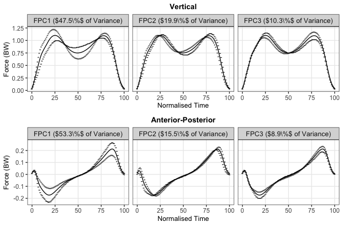
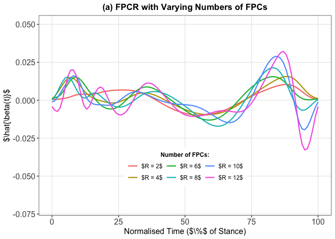
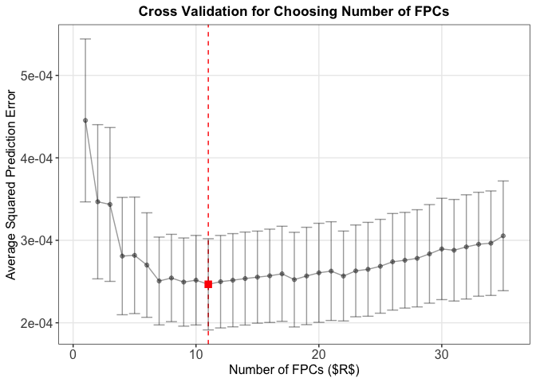
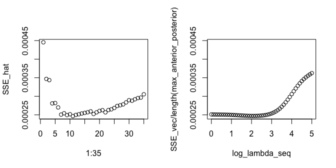
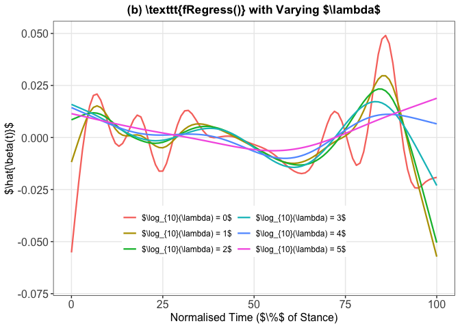
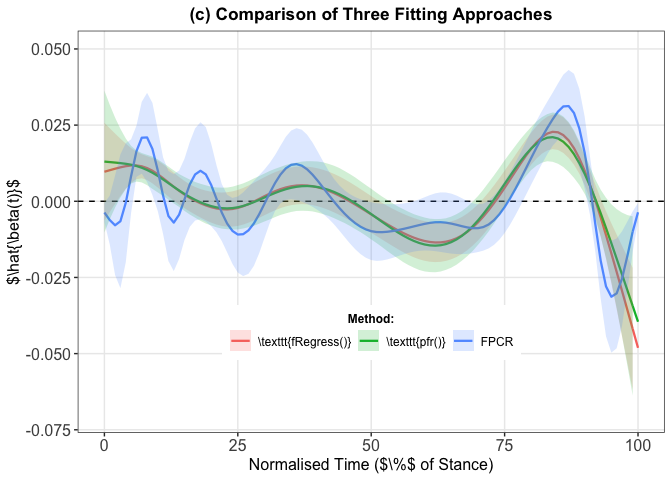

Case Study Part 2: Healthy Controls
================

Analysis of healthy controls using FPCA and scalar-on-function
regression.

# Set Up

``` r
time_start <- Sys.time()
```

Packages.

``` r
library(tidyverse)  # CRAN v1.3.1 
library(data.table) # CRAN v1.14.2
library(fda)        # CRAN v5.5.1   
library(refund)     # CRAN v0.1-26
```

Some graphics settings.

``` r
source(here::here("functions", "theme_gunning.R"))
theme_gunning()
theme_update(strip.text = element_text(size = 10),
             axis.text = element_text(size = 9),
             axis.title = element_text(size = 10),
             plot.title = element_text(size = 11))
```

Load some other helper functions.

``` r
source(here::here("functions", "center_fd_around_new_mean.R"))
source(here::here("functions", "project_data_onto_fpcs.R"))
```

Read in the data.

``` r
data_path <- here::here("chapter-06", "data", "interpolated-data.rds")
interpolated_data <- readRDS(data_path)
GRF_dataset_PRO_meta <- interpolated_data$GRF_dataset_PRO_meta
bspl_35 <- interpolated_data$bspl_35
GRF_dataset_PRO_meta[, uniqueN(SESSION_ID), by = SUBJECT_ID][, stopifnot(V1 == 1)]
```

    ## NULL

Calculate unilateral average curves for each subject and force
component:

``` r
GRF_dataset_PRO_meta[, paste0("time_",0:100) := NULL]
GRF_dataset_PRO_averages <- GRF_dataset_PRO_meta[,
                     as.list(apply(.SD, 2, mean)), # average basis coefficients of all trials
                     by = .(SUBJECT_ID, SESSION_ID, side, component, CLASS_LABEL, CLASS_LABEL_DETAILED, SEX, AGE, HEIGHT, 
                           BODY_WEIGHT, BODY_MASS, SHOE_SIZE, AFFECTED_SIDE, SHOD_CONDITION, # defines averaging
                           ORTHOPEDIC_INSOLE, SPEED),
                    .SDcols = paste0("bspl4.",1:35)] # says which columns to average
```

In this work, we focus on the **Vertical** and **Anterior-Posterior**
force components. Focus on right side averages from healthy controls
only. Construct `fd` objects from basis coefficients and basis.

``` r
averages_vertical <- GRF_dataset_PRO_averages[component == "vertical" & CLASS_LABEL == "HC" & side == "right"]
                    # create fd object defined by coefficients and basis object
fdobj_averages_vertical <- fd(coef = t(as.matrix(averages_vertical[, paste0("bspl4.",1:35)])),
                                       basisobj = bspl_35)

averages_anterior_posterior <- GRF_dataset_PRO_averages[component == "anterior_posterior"  & CLASS_LABEL == "HC" & side == "right"]
                    # create fd object defined by coefficients and basis object
fdobj_averages_anterior_posterior <- fd(coef = t(as.matrix(averages_anterior_posterior[, paste0("bspl4.",1:35)])),
                                      basisobj = bspl_35)
```

# FPCA

Then perform FPCA using `pca.fd()`

``` r
# vertical:
fpca_averages_vertical <- pca.fd(fdobj = fdobj_averages_vertical,
                                 nharm = 35)
# ap:
fpca_averages_anterior_posterior <- pca.fd(fdobj = fdobj_averages_anterior_posterior,
                                           nharm = 35)
```

Look at cumulative variance explained.

``` r
data.table(k = 1:10,
           vertical = round(100 * cumsum(fpca_averages_vertical$varprop[1:10]), 2),
           ap = round(100* cumsum(fpca_averages_anterior_posterior$varprop[1:10]), 2)) %>%
  kableExtra::kable(caption = "Cumulative % of Variance Explained") %>%
  kableExtra::kable_styling()
```

<table class="table" style="margin-left: auto; margin-right: auto;">
<caption>
Cumulative % of Variance Explained
</caption>
<thead>
<tr>
<th style="text-align:right;">
k
</th>
<th style="text-align:right;">
vertical
</th>
<th style="text-align:right;">
ap
</th>
</tr>
</thead>
<tbody>
<tr>
<td style="text-align:right;">
1
</td>
<td style="text-align:right;">
47.51
</td>
<td style="text-align:right;">
53.30
</td>
</tr>
<tr>
<td style="text-align:right;">
2
</td>
<td style="text-align:right;">
67.37
</td>
<td style="text-align:right;">
68.78
</td>
</tr>
<tr>
<td style="text-align:right;">
3
</td>
<td style="text-align:right;">
77.68
</td>
<td style="text-align:right;">
77.72
</td>
</tr>
<tr>
<td style="text-align:right;">
4
</td>
<td style="text-align:right;">
85.48
</td>
<td style="text-align:right;">
84.06
</td>
</tr>
<tr>
<td style="text-align:right;">
5
</td>
<td style="text-align:right;">
91.27
</td>
<td style="text-align:right;">
89.39
</td>
</tr>
<tr>
<td style="text-align:right;">
6
</td>
<td style="text-align:right;">
94.25
</td>
<td style="text-align:right;">
93.57
</td>
</tr>
<tr>
<td style="text-align:right;">
7
</td>
<td style="text-align:right;">
96.36
</td>
<td style="text-align:right;">
95.42
</td>
</tr>
<tr>
<td style="text-align:right;">
8
</td>
<td style="text-align:right;">
98.00
</td>
<td style="text-align:right;">
96.81
</td>
</tr>
<tr>
<td style="text-align:right;">
9
</td>
<td style="text-align:right;">
98.71
</td>
<td style="text-align:right;">
97.84
</td>
</tr>
<tr>
<td style="text-align:right;">
10
</td>
<td style="text-align:right;">
99.20
</td>
<td style="text-align:right;">
98.51
</td>
</tr>
</tbody>
</table>

Gather and reshape data to do a nice plot of FPCs as perturbations of
the mean function.

``` r
# Figure for Vertical: ----------------------------------------------------
vertical_fpcs_eval <- eval.fd(evalarg = 0:100, fpca_averages_vertical$harmonics)
vertical_fpcs_dt <- data.table(time = 0:100, vertical_fpcs_eval)
vertical_fpcs_dt_long <- melt.data.table(vertical_fpcs_dt, id.vars = "time", measure.vars = paste0("PC",1:35))
vertical_mean_dt <- data.table(time = 0:100, mean = c(eval.fd(0:100, fpca_averages_vertical$meanfd)))
vertical_fpcs_dt_long <- merge.data.table(x = vertical_fpcs_dt_long, 
                                          y = vertical_mean_dt, 
                                          by = "time",
                                          all.x = TRUE)
vertical_var_explained_dt <- data.table(variable = paste0("PC", 1:35), 
                                        constant = (2 * sqrt(fpca_averages_vertical$values))[1:35], # to add to fpcs
                                        var_explained = paste0("$", round(fpca_averages_vertical$varprop * 100, 1), "\\%$"))

vertical_fpcs_dt_long <- merge.data.table(x = vertical_fpcs_dt_long, 
                                          vertical_var_explained_dt,
                                          by = "variable", all.x = TRUE)


vertical_fpcs_dt_long[, facet_label := paste0("F", variable, " (", var_explained, " of Variance)")]
vertical_plot <- ggplot(vertical_fpcs_dt_long[variable %in% paste0("PC", 1:3)]) +
  aes(x = time) +
  facet_wrap(~ facet_label, ncol = 3) +
  geom_line(aes(y = mean)) +
  geom_point(aes(y = mean + constant * value), pch = "+", size = 1.5) +
  geom_point(aes(y = mean - constant * value), pch = "-", size = 3) +
  labs(x = "Normalised Time", y = "Force (BW)", title = "Vertical")


# Figure for Anterior-Posterior: ----------------------------------------------------
anterior_posterior_fpcs_eval <- eval.fd(evalarg = 0:100, fpca_averages_anterior_posterior$harmonics)
anterior_posterior_fpcs_dt <- data.table(time = 0:100, anterior_posterior_fpcs_eval)
anterior_posterior_fpcs_dt_long <- melt.data.table(anterior_posterior_fpcs_dt, id.vars = "time", measure.vars = paste0("PC",1:35))
anterior_posterior_mean_dt <- data.table(time = 0:100, mean = c(eval.fd(0:100, fpca_averages_anterior_posterior$meanfd)))
anterior_posterior_fpcs_dt_long <- merge.data.table(x = anterior_posterior_fpcs_dt_long, 
                                          y = anterior_posterior_mean_dt, 
                                          by = "time",
                                          all.x = TRUE)
anterior_posterior_var_explained_dt <- data.table(variable = paste0("PC", 1:35), 
                                        constant = (2 * sqrt(fpca_averages_anterior_posterior$values))[1:35], # to add to fpcs
                                        var_explained = paste0("$", round(fpca_averages_anterior_posterior$varprop * 100, 1), "\\%$"))

anterior_posterior_fpcs_dt_long <- merge.data.table(x = anterior_posterior_fpcs_dt_long, 
                                          anterior_posterior_var_explained_dt,
                                          by = "variable", all.x = TRUE)


anterior_posterior_fpcs_dt_long[, facet_label := paste0("F", variable, " (", var_explained, " of Variance)")]
anterior_posterior_plot <- ggplot(anterior_posterior_fpcs_dt_long[variable %in% paste0("PC", 1:3)]) +
  aes(x = time) +
  facet_wrap(~ facet_label, ncol = 3) +
  geom_line(aes(y = mean)) +
  geom_point(aes(y = mean + constant * value), pch = "+", size = 1.5) +
  geom_point(aes(y = mean - constant * value), pch = "-", size = 3) +
  labs(x = "Normalised Time", y = "Force (BW)", title = "Anterior-Posterior")

(combined_plot <- ggpubr::ggarrange(vertical_plot, anterior_posterior_plot, nrow = 2, ncol = 1))
```

<!-- -->

Look at cross correlation between first two sets of FPC scores:

``` r
cross_cor_mat <- cor(fpca_averages_vertical$scores[,1:5],
                     fpca_averages_anterior_posterior$scores[,1:5])

cross_correlation <- ggcorrplot::ggcorrplot(corr = cross_cor_mat, lab = TRUE) +
  labs(x = "Vertical FPCA Scores",
       y =  "Anterior-Posterior FPCA Scores",
       colour = "Correlation",
       title = "(a) Cross Correlation") +
  theme_bw() +
  theme(axis.title = element_text(face = "bold"), 
        panel.border = element_blank(), 
        legend.position = "none",
        axis.text = element_text(face = "bold", size = 11),
        panel.grid = element_blank(),
        axis.ticks = element_blank(),
        plot.title = element_text(face = "bold", hjust = 0.5)
        )

cross_correlation
```


Look at how **maximum AP force** (discrete scalar variable) relates to
**vertical FPC scores**.

Get maximum force first:

``` r
stopifnot(averages_anterior_posterior$SUBJECT_ID == averages_vertical$SUBJECT_ID)
max_anterior_posterior <- apply(eval.fd(0:100, fdobj_averages_anterior_posterior), 2, max)
vertical_fpca_scores <- fpca_averages_vertical$scores
```

And plot vs. FPC scores.

``` r
scores_and_max_dt <- data.table(max_anterior_posterior, vertical_fpca_scores)

p1 <- ggplot(data = scores_and_max_dt) +
  aes(y = max_anterior_posterior, x = V1) +
  geom_point() +
  labs(y = "Max. A-P Force",
        x = "Vertical FPC1 Score") +
  stat_smooth(method = "lm", se = FALSE)

p2 <- ggplot(data = scores_and_max_dt) +
  aes(y = max_anterior_posterior, x = V2) +
  geom_point() +
  labs(y = "Max. A-P Force",
       x = "Vertical FPC2 Score") +
  stat_smooth(method = "lm", se = FALSE)

(scores_vs_max_plot <- ggpubr::ggarrange(p1, p2, nrow = 1, ncol = 2))
```

    ## `geom_smooth()` using formula = 'y ~ x'
    ## `geom_smooth()` using formula = 'y ~ x'


# Scalar-on-Function Regression

Now, let’s use the **Vertical Curves** to predict the (scalar/ discrete)
Maximum Anterior-Posterior Force.

Update some graphics settings for this section.

``` r
theme_update(strip.text = element_text(size = 10),
             axis.text = element_text(size = 12),
             axis.title = element_text(size = 12),
             plot.title = element_text(size = 13))
```

## Functional Principal Component Regression (FPCR) (`lm()`)

### Demo:

Use the FPC scores from the last step in a standard linear regression
model to predict the max. AP force.

Let’s do it first using different numbers of FPCs, before choosing a
“best” number to use:

``` r
# Do the multivariable linear regression:
# (manually using the fpc scores and lm() function)
fpcr <- lm(max_anterior_posterior ~ vertical_fpca_scores)
beta_stars <- fpcr$coefficients[-1] # Extract the weights of the coefficient function.
fpcr_reconstruction <- matrix(NA, nrow = 101, ncol = 35)

# NOTE: ONLY CAN DO THIS BECAUSE ORTHOGONALITY; DOESN'T WORK FOR E.G., SMOOTHED FPCS;
# because we'd have to fit a separate model for each k (multicollinearity)
vertical_fpcs_eval <- eval.fd(0:100, fpca_averages_vertical$harmonics) # evaluate the FPC basis functions on a grid.
for(k in 1:35) {
  fpcr_reconstruction[, k] <- (vertical_fpcs_eval[, 1:k] %*% matrix(beta_stars[1:k], nrow = k, ncol = 1))[,1]
}

fpcr_reconstruction_dt <- data.table(time = 0:100, fpcr_reconstruction)
names(fpcr_reconstruction_dt)[-1] <- paste0("$R = ", 1:35, "$")
fpcr_reconstruction_dt_long <- melt.data.table(data = fpcr_reconstruction_dt, 
                                               id.vars = "time")
fpcr_plot <- ggplot(data = fpcr_reconstruction_dt_long[variable %in% paste0("$R = ", seq(2, 12, by = 2), "$")]) +
  aes(x = time, y = value, group = variable, colour = variable) +
  geom_line(linewidth = 0.8) +
  labs(x = "Normalised Time ($\\%$ of Stance)",
       y = "$\\hat{\\beta(t)}$",
       title = "(a) FPCR with Varying Numbers of FPCs",
       colour = "Number of FPCs:") +
  theme(legend.position = c(0.5, 0.24),
        legend.title = element_text(hjust = 0.5, face = "bold")) +
  scale_y_continuous(limits = c(-0.07, 0.05)) +
  guides(colour=guide_legend(nrow=2))

fpcr_plot
```

<!-- -->

### Cross-Validation

Use a cross-validation routine to choose number of FPCs to use:

- Do Leave-One-Out (LOO) CV – no need to shuffle data beforehand. Code
  can be generalised to $k$-fold, but need to shuffle.

- Writing CV manually using
  <https://gist.github.com/duttashi/a51c71acb7388c535e30b57854598e77>

- Do a new FPCA and `lm()` fit on each iteration – no data leakage

``` r
nfolds <- length(max_anterior_posterior)
folds <- cut(seq(1,length(max_anterior_posterior)),breaks=nfolds,labels=FALSE) # create folds

kmax <- 35
SSE_cv_mat <- matrix(NA, nrow = nfolds, ncol = kmax)

for(i in seq_len(nfolds)){
  # print(paste("i =",i))
  # get train data
  testIndexes <- which(folds==i,arr.ind = TRUE)
  # perform fpca on training
  fpca_train <- pca.fd(fdobj = fdobj_averages_vertical[-testIndexes], nharm = kmax)
  # construct training dataset for model fits
  trainData <- data.frame(max_anterior_posterior = max_anterior_posterior[-testIndexes], fpca_train$scores)
  names(trainData)[-1] <- paste0("PC", 1:kmax)
  
  # get test functional data
  fd_obj_test <- fdobj_averages_vertical[testIndexes]
  # get test data fpc scores by centering around training mean and projecting onto training fpcs
  fd_obj_test_cent <- center_fd_around_new_mean(fdobj = fd_obj_test, fpca_train$meanfd)
  fpc_scores_test <- project_data_onto_fpcs(fdobj = fd_obj_test_cent, pca.fd_obj = fpca_train)
  testData <- data.frame(max_anterior_posterior = max_anterior_posterior[testIndexes], fpc_scores_test)
  names(testData)[-1] <- paste0("PC", 1:kmax)
  
  
  for(k in 1:kmax) {
    # print(paste("k =", k))
    formula_k <- formula(paste0("max_anterior_posterior ~ ", paste(colnames(trainData)[-1][1:k], collapse = "+")))
    lm_train <- lm(formula = formula_k, data = trainData)
    yhat <- predict(lm_train, newdata = testData)
    errors <- (testData[, "max_anterior_posterior"] - yhat)
    SSE_cv_mat[i, k] <- sum(errors^2)
  }
}
```

Gather and plot results of CV:

``` r
SSE_hat <- apply(SSE_cv_mat, 2, mean)
SSE_se <- apply(SSE_cv_mat, 2, sd) / sqrt(nrow(SSE_cv_mat))
# plot(1:kmax, SSE_hat, ylim = range(SSE_hat - 2*SSE_se, SSE_hat + 2*SSE_se), type = "b", xlab = "k", ylab = "SSE")
# points(1:kmax, SSE_hat + 2*SSE_se, type = "b", col = "red", lty = 2, pch = 14)
# points(1:kmax, SSE_hat - 2*SSE_se, type = "b", col = "red", lty = 2, pch = 14)

(k_best <- which.min(SSE_hat))
```

    ## [1] 11

``` r
(cv_plot <- ggplot(data.table(k = seq_len(35),
           SSE_hat = SSE_hat,
           SSE_lower = SSE_hat + 2*SSE_se,
           SSE_upper = SSE_hat - 2*SSE_se)) +
  aes(x = k, y = SSE_hat) +
  geom_vline(xintercept = k_best, lty = 2, col = "red") +
  geom_line(alpha = 0.4) +
  geom_errorbar(aes(ymin = SSE_lower, ymax = SSE_upper), alpha = 0.4) +
  geom_point(alpha = 0.4) + 
  geom_point(data = . %>% filter(k == k_best), colour = "red", size = 3, pch = 15) +
  labs(x = "Number of FPCs ($R$)",
       y = "Average Squared Prediction Error",
       title = "Cross Validation for Choosing Number of FPCs"))
```

<!-- -->

Do fit on full data with chosen $R=11$.

``` r
df_fpcr <- data.frame(max_anterior_posterior = max_anterior_posterior,
                      vertical_fpca_scores[, 1:11])
colnames(df_fpcr)[-1] <- paste0("vertical_fpca_scores", 1:11)
formula_fpcr <- formula(paste("max_anterior_posterior ~", paste(paste0("vertical_fpca_scores", 1:11), collapse = " + "), collapse = ""))
fpcr_best <- lm(formula = formula_fpcr, data = df_fpcr)
```

And get confidence intervals using:

``` r
fpcr_beta_best <-(vertical_fpcs_eval[, 1:k_best] %*% matrix(fpcr_best$coefficients[-1], nrow = k_best, ncol = 1))[,1]
fpcr_beta_se_best <- sqrt(diag(vertical_fpcs_eval[, 1:k_best] %*%  vcov(fpcr_best)[-1,-1] %*% t(vertical_fpcs_eval[, 1:k_best])))
```

Rough plot of estimated coefficient function $\beta(t)$ and CIs:

``` r
plot(fpcr_beta_best, type = "l", xlab = "Normalised Time (% of Stance)", ylab = expression(beta(t)))
abline(h=0)
lines(fpcr_beta_best - 2 * fpcr_beta_se_best, lty = 2)
lines(fpcr_beta_best + 2 * fpcr_beta_se_best, lty = 2)
```


Some quick diagnostic plots for linear model:

``` r
par(mfrow = c(1, 2))
plot(x = max_anterior_posterior,  y = predict(fpcr_best), ylab = "predicted", xlab = "observed")
hist(resid(fpcr_best), main = "Hist. of Resid.")
```


## `fRegress()`

Represent $\beta(t)$ using a spline basis and a roughness penalty using
`fRegress()`.

Some notes:

- We do LOO-CV using built in function `fRegress.CV()`. Requires scalar
  parameters be set up as a “function” with a constant basis.

- Use same basis of $35$ B-splines for $\beta(t)$, integrated squared
  second derivative penalty (see `Lfdobj = 2`).

``` r
# Need to create constant fd object for scalar predictor to work in fRegress.CV(), weird, I know.
constant_basis <- create.constant.basis(c(0,100))
constant_fd <- fd(coef = matrix(1, nrow = 1, ncol = ncol(fdobj_averages_vertical$coefs)), basisobj = constant_basis)
# List containing predictors (jntercept and functional covariate)
xfd_list <- list(constant_fd, # for intercept
                 fdobj_averages_vertical) # functional coefficient
log_lambda_seq <- seq(0, 5, by = 0.1)
# Let's store out of samples predictions errrors:
SSE_vec <- vector("numeric", length = length(log_lambda_seq))

# Cross-Validation Loop:
for(i in seq_along(log_lambda_seq)) {
  # print(paste0("Iteration ", i, " of ", length(log_lambda_seq)))
  # set up fdPar with value of lambda for this iteration:
  beta_list <- list(fdPar(create.constant.basis(c(0,100))), # for intercept
                    fdPar(fdobj = bspl_35, Lfdobj = 2, lambda = 10^log_lambda_seq[i])) # for functional coefficient
  # LOO-CV:
  CV_fit_i <- fRegress.CV(y = max_anterior_posterior, 
                      xfdlist = xfd_list,
                      betalist = beta_list)
  # Store Result:
  SSE_vec[i] <- CV_fit_i$SSE.CV
  }
```

Choose best $\lambda$ based on CV:

``` r
(log_lamba_best <- log_lambda_seq[which.min(SSE_vec)])
```

    ## [1] 2.1

Look at difference in CV estimates for FPCR and `fRegress()` – the
smoothing penalty approach varies much more smoothly!

``` r
par(mfrow = c(1, 2))
plot(1:35, SSE_hat, ylim = range(SSE_hat, SSE_vec/ length(max_anterior_posterior)))
plot(log_lambda_seq, SSE_vec/ length(max_anterior_posterior), ylim = range(SSE_hat, SSE_vec/ length(max_anterior_posterior)))
```

<!-- -->

Do model fit on full dataset using best smoothing parameter:

``` r
beta_list_best <- list(fdPar(create.constant.basis(c(0,100))), # for intercept
                              fdPar(fdobj = bspl_35, Lfdobj = 2, lambda = 10^log_lamba_best)) # for functional coefficient
# cv:
fRegress_best_fit <- fRegress(y = max_anterior_posterior, 
                        xfdlist = xfd_list,
                        betalist = beta_list_best)
```

Get confidence intervals for model fit (note we have conditioned on our
“best” $\lambda$):

Based on Ramsay, Hooker and Graves pp.140-141.

``` r
N <- length(max_anterior_posterior)
max_anterior_posterior_hat <- fRegress_best_fit$yhatfdobj[,1]
resid <-  max_anterior_posterior - max_anterior_posterior_hat
SigmaE <- sum(resid^2)/(N- fRegress_best_fit$df)
SigmaE <- SigmaE*diag(rep(1,N))
y2cMap <- smooth.basis(argvals = 0:100, y = eval.fd(0:100, fdobj_averages_vertical[1]), fdParobj = bspl_35)$y2cMap # didn't have smooth.basis stored.
fRegress_best_fit_stderrList <- fRegress.stderr(y = fRegress_best_fit, 
                             y2cMap = y2cMap,
                             SigmaE = SigmaE)
```

And a nice plot to show what happend when we vary lambda:

``` r
# Let's do a plot of varying lambda: --------------------------------------
fregress_varying_lambda_log_lambda_grid <- seq(0, 5, by = 1)
fregress_varying_lambda_beta_mat <- matrix(NA, nrow = 101, ncol = length(fregress_varying_lambda_log_lambda_grid))

for(i in seq_along(fregress_varying_lambda_log_lambda_grid)) {
  beta_list <- list(fdPar(create.constant.basis(c(0,100))), # for intercept
                    fdPar(fdobj = bspl_35, Lfdobj = 2, lambda = 10^fregress_varying_lambda_log_lambda_grid[i])) # for functional coefficient
  fregress_i <- fRegress(y = max_anterior_posterior, 
              xfdlist = xfd_list,
              betalist = beta_list)
  fregress_varying_lambda_beta_mat[,i] <- c(eval.fd(0:100, fregress_i$betaestlist[[2]]$fd))
}
fregress_varying_lambda_dt <- data.table(time = 0:100, fregress_varying_lambda_beta_mat)
names(fregress_varying_lambda_dt)[-1] <- paste0("$\\log_{10}(\\lambda) = ", fregress_varying_lambda_log_lambda_grid, "$")
fregress_varying_lambda_dt <- melt.data.table(data = fregress_varying_lambda_dt, 
                                              id.vars = "time")

fregress_varying_lambda_plot <- ggplot(data = fregress_varying_lambda_dt) +
  aes(x = time, y = value, group = variable, colour = variable) +
  geom_line(linewidth = 0.8) +
  labs(x = "Normalised Time ($\\%$ of Stance)",
       y = "$\\hat{\\beta(t)}$",
       title = "(b) \\texttt{fRegress()} with Varying $\\lambda$",
       colour = "$\\log_{10}(\\lambda)$") +
  scale_y_continuous(limits = c(-0.07, 0.05)) +
  theme(legend.position = c(0.45, 0.235),
        legend.margin = margin(t=0, b=0),
        legend.title = element_blank()) +
  guides(colour=guide_legend(nrow=3))

fregress_varying_lambda_plot 
```

<!-- -->

## `pfr()`

With `pfr()` it is **really** simple. We need to feed in the functional
predictor evaluated on a grid (note: manual says that we can supply `fd`
object). For now, we just evaluate at $0,1,2\dots,100$:

- `lf()` specifies a linear functional predictor of the form
  $\int x(t) \beta(t) \mathrm{d}t$.

- Use `bs = "bs"` for a “B-spline basis with integrated squared
  derivative penalties” (see `?mgcv::smooth.terms` for details).

``` r
vertical_fd_eval <- t(eval.fd(evalarg = 0:100, fdobj = fdobj_averages_vertical))
pfr <- pfr(max_anterior_posterior ~ lf(X = vertical_fd_eval, bs = "bs", k = 35, argvals = 0:100))
```

## Comparison of three fitting approaches

### Estimates of $\beta(t)$

``` r
best_estimates_dt <- data.table(time = 0:100, 
                                pfr = c(coef(pfr)[, "value"]), 
                                fpcr = fpcr_beta_best,
                                fregress = c(eval.fd(0:100, fRegress_best_fit$betaestlist[[2]]$fd)))

best_estimates_se_dt <- data.table(time = 0:100,
                                   pfr = c(coef(pfr)[, "se"]),
                                   fpcr = fpcr_beta_se_best,
                                   fregress = c(eval.fd(0:100, fRegress_best_fit_stderrList$betastderrlist[[2]])))


best_estimates_dt_lng <- melt.data.table(data = best_estimates_dt, 
                                         id.vars = "time", 
                                         value.name = "point_est")

best_estimates_se_dt_lng <- melt.data.table(data = best_estimates_se_dt, 
                                         id.vars = "time", 
                                         value.name = "se")

plot_dt <- merge.data.table(best_estimates_dt_lng, 
                            best_estimates_se_dt_lng,
                            by = c("variable", "time"))

plot_dt[, lower := point_est - 2 * se]
plot_dt[, upper := point_est + 2 * se]

plot_dt[, method := fcase(
  variable == "pfr", "\\texttt{pfr()}",
  variable == "fregress", "\\texttt{fRegress()}",
  variable == "fpcr", "FPCR"
)]


best_estimates_plot <- ggplot(data = plot_dt) +
  aes(x = time, y = point_est, group = method, colour = method, fill = method) +
  geom_hline(yintercept = 0, lty = 2) +
  geom_line(linewidth = 0.8) +
  theme(legend.position = c(0.5, 0.25),
        legend.title = element_text(hjust = 0.5, face = "bold")) +
  geom_ribbon(mapping = aes(ymin = lower, ymax = upper), alpha = 0.2,
              colour = NA) +
  scale_y_continuous(limits = c(-0.07, 0.05)) +
  labs(x = "Normalised Time ($\\%$ of Stance)",
       y = "$\\hat{\\beta(t)}$",
       title = "(c) Comparison of Three Fitting Approaches",
       colour = "Method:",
       fill = "Method:") +
  guides(colour=guide_legend(nrow=1))

best_estimates_plot
```

<!-- -->

### In-Sample Goodness of Fit

Get $R^2$ values from each model. Note $R^2$ for `fRegress()` based on
Ramsay, Hooker and Graves p. 134.

``` r
# Print R-squared:
print(paste0("FPCR: ", 100 * round(summary(fpcr_best)$r.squared, 2), "%"))
```

    ## [1] "FPCR: 78%"

``` r
print(paste0("pfr: ", 100 * round(summary(pfr)$r.sq, 2), "%"))
```

    ## [1] "pfr: 76%"

``` r
# From RHG p.134
SSE1.1 <- sum(resid^2)
SSE0 <- sum((max_anterior_posterior - mean(max_anterior_posterior))^2)
RSQ1 = (SSE0-SSE1.1)/SSE0

print(paste0("fRegress: ", 100 * round(RSQ1, 2), "%"))
```

    ## [1] "fRegress: 78%"

### Out-of-Sample Predictions

#### Read in Test Data

``` r
data_for_testing <- readRDS(file = here::here("chapter-06", "data", "test-data.rds"))
fdobj_averages_vertical_test <- data_for_testing$fdobj_averages_vertical_test
max_anterior_posterior_test <- data_for_testing$max_anterior_posterior_test
```

#### FPCR Predictions

Need to calculate the FPC scores for the test data using the traning
FPCS:

``` r
fdobj_averages_vertical_test_cent <- center_fd_around_new_mean(fdobj = fdobj_averages_vertical_test, fpca_averages_vertical$meanfd)
GRF_fpc_scores_test <- project_data_onto_fpcs(fdobj = fdobj_averages_vertical_test_cent,
                                              pca.fd_obj = fpca_averages_vertical)

test_df_fpcr <- data.frame(max_anterior_posterior = max_anterior_posterior_test,
                           GRF_fpc_scores_test)
names(test_df_fpcr)[-1] <- paste0("vertical_fpca_scores", 1:35)
```

And then used our trained model to predict:

``` r
fpcr_test_yhat <- predict(object = fpcr_best, newdata = test_df_fpcr)
plot(x = max_anterior_posterior_test,
     y = fpcr_test_yhat,
     main = "out of sample predictions",
     xlab = "observed",
     ylab = "predicted")
```


#### `fRegress()` Predictions

Again we need our the design matrix (list) entry for our intercept to be
a constant “function”.

``` r
constant_fd_test <- fd(coef = matrix(1,
                                nrow = 1,
                                ncol = ncol(fdobj_averages_vertical_test$coefs)),
                  basisobj = constant_basis)
# List containing predictors (jntercept and functional covariate)
xfd_list_test <- list(constant_fd_test, # for intercept
                 fdobj_averages_vertical_test) 
fregress_test_yhat <- predict.fRegress(object = fRegress_best_fit,
                 newdata = xfd_list_test)
plot(x = max_anterior_posterior_test,
     y = fregress_test_yhat,
     main = "out of sample predictions",
     xlab = "observed",
     ylab = "predicted")
```


#### `pfr()`

``` r
vertical_fd_eval_test <- t(eval.fd(evalarg = 0:100, fdobj = fdobj_averages_vertical_test))
pfr_test_yhat <- predict(object = pfr, newdata = list(vertical_fd_eval = vertical_fd_eval_test))

plot(x = max_anterior_posterior_test,
     y = pfr_test_yhat,
     main = "out of sample predictions",
     xlab = "observed",
     ylab = "predicted")
```


#### Comparison of Absolute Errors

``` r
abs_errors_dt <- data.table(
  ind = seq_len(length(max_anterior_posterior_test)),
  fpcr = abs(fpcr_test_yhat - max_anterior_posterior_test),
  fRegress =  abs(c(fregress_test_yhat) - max_anterior_posterior_test),
  pfr = abs(pfr_test_yhat - max_anterior_posterior_test))

abs_errors_dt_lng <- melt.data.table(data = abs_errors_dt, 
                                     id.vars = "ind")

abs_errors_dt_lng[, method := fcase(
  variable == "pfr", "\\texttt{pfr()}",
  variable == "fRegress", "\\texttt{fRegress()}",
  variable == "fpcr", "FPCR"
)]

error_plot <- ggplot(abs_errors_dt_lng) +
  aes(x = method, y = value, group = method, fill = method) +
  geom_boxplot(alpha = 0.5) +
  labs(x = "Method",
       y = "Absolute Error", 
       title = "Out-of-Sample Prediction Errors") +
  theme(legend.position = "none")

error_plot
```


# Session Information (Reproducibility)

``` r
sessionInfo()
```

    ## R version 4.1.2 (2021-11-01)
    ## Platform: x86_64-apple-darwin17.0 (64-bit)
    ## Running under: macOS Big Sur 10.16
    ## 
    ## Matrix products: default
    ## BLAS:   /Library/Frameworks/R.framework/Versions/4.1/Resources/lib/libRblas.0.dylib
    ## LAPACK: /Library/Frameworks/R.framework/Versions/4.1/Resources/lib/libRlapack.dylib
    ## 
    ## locale:
    ## [1] en_IE.UTF-8/en_IE.UTF-8/en_IE.UTF-8/C/en_IE.UTF-8/en_IE.UTF-8
    ## 
    ## attached base packages:
    ## [1] splines   stats     graphics  grDevices utils     datasets  methods  
    ## [8] base     
    ## 
    ## other attached packages:
    ##  [1] refund_0.1-26     fda_5.5.1         deSolve_1.30      fds_1.8          
    ##  [5] RCurl_1.98-1.6    rainbow_3.6       pcaPP_1.9-74      MASS_7.3-55      
    ##  [9] Matrix_1.4-0      data.table_1.14.2 forcats_0.5.1     stringr_1.4.0    
    ## [13] dplyr_1.1.2       purrr_0.3.4       readr_2.1.2       tidyr_1.2.0      
    ## [17] tibble_3.2.1      ggplot2_3.4.2     tidyverse_1.3.1  
    ## 
    ## loaded via a namespace (and not attached):
    ##  [1] minqa_1.2.4        colorspace_2.0-3   ggsignif_0.6.3     ellipsis_0.3.2    
    ##  [5] mclust_5.4.9       rprojroot_2.0.2    fs_1.6.2           rstudioapi_0.13   
    ##  [9] farver_2.1.0       ggpubr_0.4.0       fansi_1.0.2        mvtnorm_1.1-3     
    ## [13] lubridate_1.8.0    xml2_1.3.3         knitr_1.37         jsonlite_1.8.0    
    ## [17] nloptr_2.0.0       broom_0.7.12       cluster_2.1.2      dbplyr_2.1.1      
    ## [21] compiler_4.1.2     httr_1.4.2         backports_1.4.1    ggcorrplot_0.1.4  
    ## [25] assertthat_0.2.1   fastmap_1.1.0      cli_3.6.0          htmltools_0.5.5   
    ## [29] tools_4.1.2        gtable_0.3.0       glue_1.6.2         reshape2_1.4.4    
    ## [33] Rcpp_1.0.10        carData_3.0-5      cellranger_1.1.0   vctrs_0.6.2       
    ## [37] svglite_2.1.0      nlme_3.1-155       grpreg_3.4.0       xfun_0.39         
    ## [41] lme4_1.1-30        rvest_1.0.2        lifecycle_1.0.3    rstatix_0.7.0     
    ## [45] scales_1.2.1       hms_1.1.1          parallel_4.1.2     gamm4_0.2-6       
    ## [49] yaml_2.3.5         stringi_1.7.6      highr_0.9          pbs_1.1           
    ## [53] boot_1.3-28        hdrcde_3.4         rlang_1.1.1        pkgconfig_2.0.3   
    ## [57] systemfonts_1.0.4  bitops_1.0-7       pracma_2.3.8       evaluate_0.15     
    ## [61] lattice_0.20-45    ks_1.13.4          labeling_0.4.2     cowplot_1.1.1     
    ## [65] tidyselect_1.2.0   here_1.0.1         plyr_1.8.6         magrittr_2.0.2    
    ## [69] R6_2.5.1           generics_0.1.2     RLRsim_3.1-6       DBI_1.1.2         
    ## [73] pillar_1.9.0       haven_2.4.3        withr_2.5.0        mgcv_1.8-42       
    ## [77] abind_1.4-5        modelr_0.1.8       crayon_1.5.0       car_3.0-12        
    ## [81] KernSmooth_2.23-20 utf8_1.2.2         tzdb_0.2.0         rmarkdown_2.11    
    ## [85] grid_4.1.2         readxl_1.3.1       reprex_2.0.1       digest_0.6.29     
    ## [89] webshot_0.5.2      munsell_0.5.0      viridisLite_0.4.0  kableExtra_1.3.4  
    ## [93] magic_1.6-0

Total Computing Time:

``` r
Sys.time() - time_start
```

    ## Time difference of 7.191015 mins

# References

- James O.. Ramsay, Giles Hooker, and Spencer Graves. Functional Data
  Analysis with R and MATLAB. USA: Springer, 2009.
